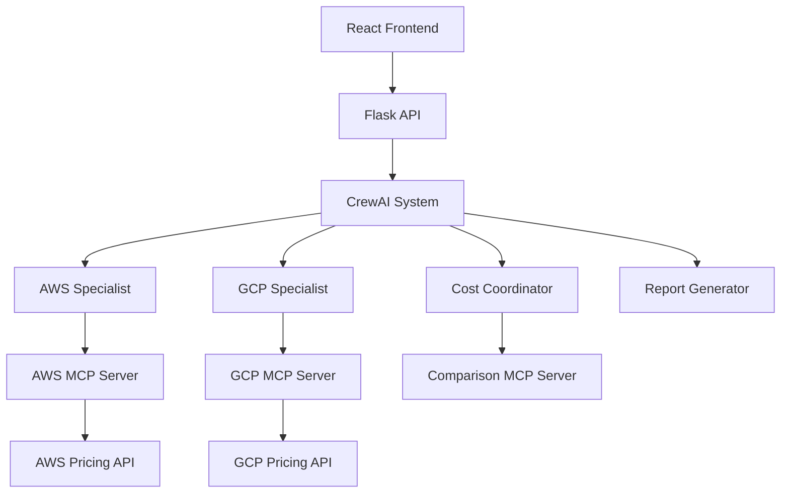

# Architecture Documentation

## System Overview

O Cloud Cost Agent é um sistema distribuído que utiliza agentes de IA especializados para analisar e comparar custos entre provedores de nuvem.



## Components

### 1. Frontend (React)
**Location**: `web_interface/cloud-cost-analyzer/`

**Technologies**:
- React 18 with Hooks
- Tailwind CSS for styling
- Framer Motion for animations
- Lucide React for icons
- Vite for build tooling

**Key Components**:
- `App.jsx`: Main application component
- `AnalysisForm`: Input forms for analysis parameters
- `ResultsDisplay`: Visualization of analysis results
- `TemplateSelector`: Pre-configured analysis templates

**Responsibilities**:
- User interface and experience
- Form validation and submission
- Results visualization
- Real-time updates during analysis

### 2. Backend API (Flask)
**Location**: `cloud-cost-agent-deploy/src/main.py`

**Technologies**:
- Flask web framework
- Flask-CORS for cross-origin requests
- JSON for data exchange

**Endpoints**:
- `/api/health`: System health check
- `/api/analyze/*`: Analysis endpoints
- `/api/providers/info`: Provider information
- `/api/templates`: Analysis templates
- `/api/analysis/history`: Analysis history

**Responsibilities**:
- HTTP request handling
- Input validation
- CrewAI system coordination
- Response formatting

### 3. CrewAI System
**Location**: `crewai_agents/`

**Architecture**:
```python
class CloudCostAnalysisCrew:
    def __init__(self):
        self.aws_specialist = Agent(...)
        self.gcp_specialist = Agent(...)
        self.cost_coordinator = Agent(...)
        self.report_generator = Agent(...)
```

**Agents**:

#### AWS Specialist
- **Role**: AWS cost and service expert
- **Goal**: Analyze AWS pricing and capabilities
- **Tools**: AWS MCP Server
- **Backstory**: Deep knowledge of AWS services and pricing models

#### GCP Specialist
- **Role**: Google Cloud cost and service expert
- **Goal**: Analyze GCP pricing and capabilities
- **Tools**: GCP MCP Server
- **Backstory**: Deep knowledge of GCP services and pricing models

#### Cost Coordinator
- **Role**: Analysis coordinator and decision maker
- **Goal**: Compare providers and make recommendations
- **Tools**: Comparison MCP Server
- **Backstory**: Expert in cloud cost optimization

#### Report Generator
- **Role**: Technical report writer
- **Goal**: Generate comprehensive analysis reports
- **Tools**: Document generation tools
- **Backstory**: Technical writing and data visualization expert

**Tasks**:
1. **AWS Analysis**: Gather AWS pricing and capability data
2. **GCP Analysis**: Gather GCP pricing and capability data
3. **Comparison**: Compare providers across multiple dimensions
4. **Recommendation**: Generate final recommendation with reasoning
5. **Report**: Create detailed technical report

### 4. MCP Servers
**Location**: `mcp_servers/`

**Model Context Protocol (MCP)** provides standardized communication between AI agents and external services.

#### AWS Pricing Server
```python
class AWSPricingServer:
    def get_ec2_pricing(self, instance_type, region)
    def get_s3_pricing(self, storage_class, region)
    def get_network_pricing(self, region)
```

#### GCP Pricing Server
```python
class GCPPricingServer:
    def get_compute_pricing(self, machine_type, region)
    def get_storage_pricing(self, storage_class, region)
    def get_network_pricing(self, region)
```

#### Comparison Server
```python
class ComparisonServer:
    def compare_compute(self, aws_data, gcp_data)
    def compare_storage(self, aws_data, gcp_data)
    def calculate_tco(self, aws_total, gcp_total, months)
```

## Data Flow

### 1. Analysis Request Flow
```
User Input → React Form → API Validation → CrewAI Crew → MCP Servers → External APIs
```

### 2. Response Flow
```
External APIs → MCP Servers → Agent Analysis → Crew Coordination → API Response → React UI
```

### 3. Detailed Analysis Process

1. **Input Processing**:
   - User submits analysis parameters
   - Frontend validates input
   - API receives and validates request

2. **Crew Initialization**:
   - CrewAI system creates agent instances
   - Agents are assigned specific tasks
   - MCP servers are initialized

3. **Parallel Analysis**:
   - AWS Specialist queries AWS pricing
   - GCP Specialist queries GCP pricing
   - Both agents work simultaneously

4. **Data Aggregation**:
   - Cost Coordinator receives agent results
   - Performs comparative analysis
   - Calculates TCO and savings

5. **Report Generation**:
   - Report Generator creates detailed analysis
   - Includes reasoning and recommendations
   - Formats for API response

6. **Response Delivery**:
   - API formats final response
   - Frontend receives and displays results
   - User sees comprehensive analysis

## Scalability Considerations

### Horizontal Scaling
- **API Layer**: Multiple Flask instances behind load balancer
- **Agent Pool**: Distribute CrewAI agents across multiple processes
- **MCP Servers**: Independent scaling of pricing servers

### Vertical Scaling
- **Memory**: Increase for larger analysis datasets
- **CPU**: More cores for parallel agent processing
- **Storage**: Cache pricing data for faster responses

### Caching Strategy
```python
# Redis cache for pricing data
cache_key = f"aws_ec2_{instance_type}_{region}"
cached_price = redis.get(cache_key)
if not cached_price:
    price = fetch_from_api()
    redis.setex(cache_key, 3600, price)  # 1 hour TTL
```

## Security Architecture

### API Security
- **CORS**: Configured for specific origins in production
- **Rate Limiting**: Prevent abuse of analysis endpoints
- **Input Validation**: Sanitize all user inputs
- **Error Handling**: Don't expose internal details

### Data Security
- **No PII Storage**: System doesn't store personal information
- **API Keys**: Secure storage of cloud provider credentials
- **Encryption**: HTTPS for all communications

### Agent Security
- **Sandboxing**: Agents run in isolated environments
- **Permission Model**: Limited access to external resources
- **Audit Logging**: Track all agent actions

## Performance Optimization

### Frontend Optimization
- **Code Splitting**: Lazy load components
- **Bundle Optimization**: Tree shaking and minification
- **Caching**: Browser cache for static assets
- **CDN**: Serve assets from edge locations

### Backend Optimization
- **Connection Pooling**: Reuse database connections
- **Async Processing**: Non-blocking I/O operations
- **Response Compression**: Gzip compression
- **Database Indexing**: Optimize query performance

### Agent Optimization
- **Parallel Execution**: Concurrent agent tasks
- **Result Caching**: Cache analysis results
- **Smart Routing**: Route requests to optimal agents
- **Resource Pooling**: Reuse agent instances

## Monitoring and Observability

### Metrics
- **API Metrics**: Response time, error rate, throughput
- **Agent Metrics**: Task completion time, success rate
- **System Metrics**: CPU, memory, disk usage

### Logging
```python
import logging

logger = logging.getLogger(__name__)
logger.info(f"Analysis started: {analysis_id}")
logger.error(f"Agent failed: {agent_name} - {error}")
```

### Tracing
- **Request Tracing**: Track requests across components
- **Agent Tracing**: Monitor agent task execution
- **Performance Tracing**: Identify bottlenecks

## Deployment Architecture

### Development Environment
```
Local Machine → Docker Containers → Local Testing
```

### Staging Environment
```
GitHub → CI/CD Pipeline → Staging Server → Integration Tests
```

### Production Environment
```
GitHub → CI/CD Pipeline → Production Server → Health Checks
```

### Infrastructure as Code
```yaml
# docker-compose.yml
version: '3.8'
services:
  api:
    build: .
    ports:
      - "5000:5000"
    environment:
      - FLASK_ENV=production
  
  redis:
    image: redis:alpine
    ports:
      - "6379:6379"
```

## Future Architecture Considerations

### Microservices Migration
- Split monolithic API into microservices
- Service mesh for inter-service communication
- Independent scaling and deployment

### Event-Driven Architecture
- Message queues for async processing
- Event sourcing for audit trails
- CQRS for read/write separation

### AI/ML Pipeline
- Model training pipeline
- A/B testing for recommendations
- Continuous learning from user feedback

### Multi-Cloud Support
- Abstract cloud provider interfaces
- Plugin architecture for new providers
- Unified cost modeling across providers

